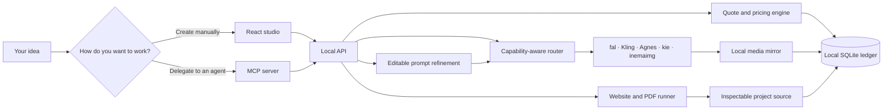
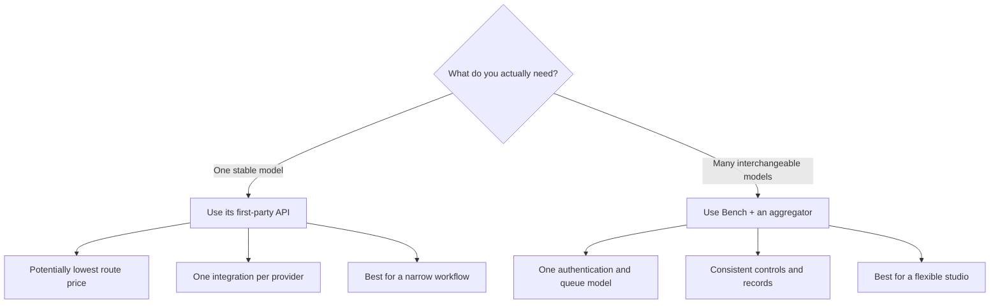
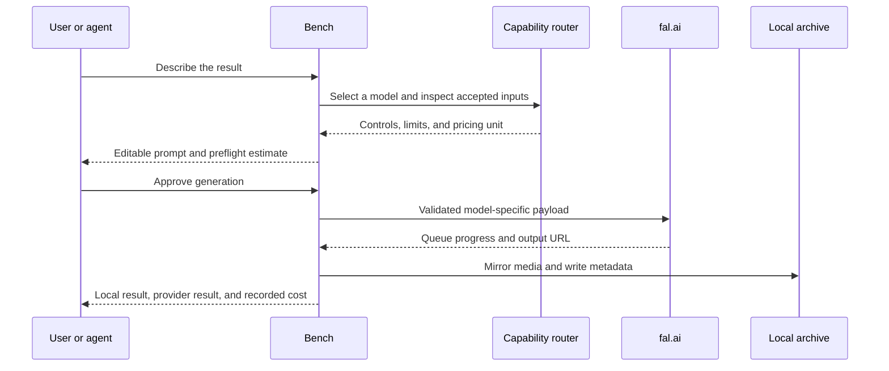
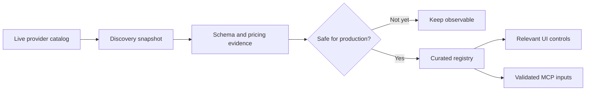
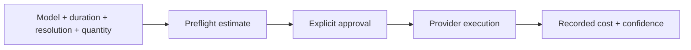
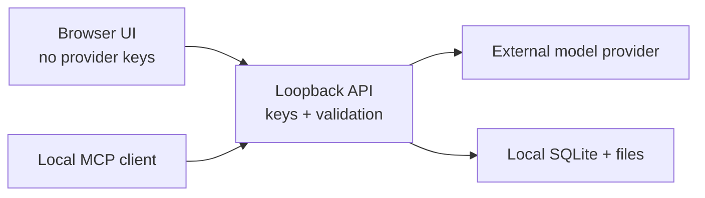

# Bench Studio — what it is, and why it works this way

The [README](../README.md) is for installing, running and maintaining the
studio. This document is the other half: what the system does, the reasoning
behind each choice, and what it deliberately does not do.

For the internals — process anatomy, the providers layer, how cost is computed,
where files live — read [`COMO-FUNCIONA.md`](COMO-FUNCIONA.md) (in Portuguese).

---

## Why this exists

Most creative AI products combine five useful pieces—model access, prompt
polish, routing, storage, and billing—then hide the seams behind a monthly plan.
Bench keeps the convenience while making every seam inspectable.

| Instead of… | Bench gives you… |
| --- | --- |
| One provider's model roadmap | A curated registry you can add to or replace |
| A generic upload box | Controls derived from each endpoint's accepted inputs |
| An invisible prompt rewrite | An editable model-specific draft before submission |
| Abstract credits | A preflight estimate and recorded spend metadata |
| Outputs trapped in an account gallery | Local mirrored files and durable metadata |
| A UI-only workflow | The same capabilities through the UI and MCP |
| Waiting for the next feature | Source you can inspect, change, and extend |

Bench does **not** own the underlying models. It gives you ownership of the
portable layer that connects your ideas, tools, providers, files, and costs.

## Tips that save you time and money

**Start with the free routes.** Agnes (4 models) and inemaimg (2, on your own
GPU) cost nothing. In the Model catalog, the **No cost** switch turns exactly
that group on. Use them to find the prompt that works, then spend on the model
that renders it best.

**Curate the catalog once.** 73 models is a lot to scroll. Filter by provider,
then use "Disable those N" to hide what you will not use. Curation is a
preference, not a block: it hides models from the pickers but a **Redo** of an
old result still works. Deleting `data/catalog-prefs.json` restores the factory
state.

**Refine before you spend.** The refined prompt is editable before submission.
Read it. It is the cheapest place to catch a misunderstanding — after you submit,
the fix costs another run.

**Keep two refiners configured.** The chain is Gemini → OpenRouter → local Codex.
With a single one, an exhausted quota takes the whole studio down: the prompt
goes through raw, and Agnes rejects non-English with an error that looks like an
Agnes problem but is not.

**Redo instead of retyping.** Every result carries the model, controls, refined
prompt, original idea and attachments. Redo restores all of it, so you can tweak
one thing without paying for a rewrite.

**The same model can exist on two routes.** Veo, Nano Banana, gpt-image and
gemini-image appear via more than one provider — with different bills (dollars on
fal, plan credits on Kling). The provider is shown next to the name in the
picker; it is a real choice, not a duplicate.

**Kling never auto-retries, on purpose.** Every Kling job is charged, including
failures. Nothing is resubmitted behind your back.

**Watch disk, not CPU.** Every file is mirrored locally because provider URLs
expire — 24h on Kling, temporary on Agnes. Roughly 1.3 MB per image and 0.7–5 MB
per video. The studio idles at 274 MB of RAM.

**Building a website? Prefer an agent.** Codex and Claude Code write the files
themselves and fix their own mistakes. The model engines (local Qwen, OpenRouter)
only return text, so they need no sandbox and cost nothing — but they need more
supervision.

**Point the builder at a reference you own.** Set a site or PDF of yours in
Config and the builder calibrates its finish against it — tokens, fonts, palette,
radii. It never copies brand, copy, structure or files.

## What you can make

| Workspace | What it delivers |
| --- | --- |
| **Create** | Images and videos with model-aware references, controls, editable prompt drafts, quotes, progress, and inline results. |
| **Model catalog** | Curated text-to-image, image-editing, text-to-video, image-to-video, and reference-video routes. |
| **Results** | A local archive containing the submitted prompt, model, provider URL, local file, and recorded cost. |
| **Websites** | Original static sites with editable source, a local preview, and a downloadable bundle. |
| **Documents** | Designed PDFs backed by editable HTML, Chromium printing, and overflow preflight. |
| **Connect** | Machine-correct MCP configuration and a portable skill for compatible agents. |


## The system in 30 seconds



The browser never receives provider secrets. It talks to a local service that
validates model-specific payloads, owns credentials, streams progress, mirrors
artifacts, and records durable metadata.

## Choose the right connection strategy

Bench uses an aggregator because one authentication and queue model is the
practical way to support a large, interchangeable catalog. That is not the
only valid architecture.



An aggregator may not always be the cheapest route. Bench makes that tradeoff
explicit instead of calling it “zero markup.”

## One request, from idea to receipt



Bench records what was submitted. It never claims an attached reference
influenced an output merely because an API accepted the field; creative
fidelity still requires human review.

## Model intelligence, not a dropdown full of URLs

Every endpoint has different assumptions. Some accept one image, some accept a
list, some require a start frame, and others accept no references. Bench keeps
discovery separate from production admission:



This prevents a newly published, renamed, or underspecified model from silently
breaking a paid workflow.

## Prompt refinement stays visible

1. Write a normal creative request.
2. Bench adds the structure the selected model is likely to understand.
3. Review the rewritten prompt as an editable draft.
4. Change or reject it before spending anything.
5. Store the final submitted prompt with the result.

If no Google key is configured, the original prompt passes through unchanged
and the interface reports that refinement is disabled.

## Cost transparency without marketing math

Before submission, Bench estimates cost from the model's pricing unit and the
requested parameters. After completion, it records the billed amount when the
provider exposes sufficient receipt data.



Pricing changes. Estimates are not guarantees. Bench distinguishes estimated,
metered, and recorded values instead of presenting all three as the same fact.

## Your local data boundary

The repository starts with no `data/` directory. Bench creates it on first run:

```text
data/
├── bench.db              # generations, assets, spend, and projects
├── inputs/               # mirrored uploads
├── outputs/              # mirrored generations
├── previews/             # local video posters
└── projects/             # website and document source files
```

The entire directory is ignored by Git. Deleting a result removes its local
database record and mirrored files. It does not claim to delete copies retained
by an external model provider.



## Use it from Claude, Codex, or Cursor

Start Bench, open **Connect**, choose your client, and copy the generated
configuration. Bench inserts the correct absolute path for the current machine;
the repository itself ships with no user's home directory.

The MCP server exposes eleven focused tools for:

- discovering models and inspecting capability contracts;
- uploading local reference media;
- generating images and videos;
- reading results, previews, and spend;
- creating and polling website or document projects;
- retrieving local project artifacts.

The bundled skill in `integrations/skills/bench-studio/` provides judgment and
workflow guidance. MCP provides the live execution layer.

## Project map

```text
bench-studio-public/
├── src/                     # React interface
├── server/
│   ├── server.mjs           # loopback API and orchestration
│   ├── mcp.mjs              # stdio MCP server
│   ├── registry.json        # curated production roster
│   ├── capabilities.json    # accepted-input contracts
│   ├── profiles/            # prompt and pricing intelligence
│   └── mcp-app/             # embedded MCP interface
├── integrations/
│   ├── skills/bench-studio/ # portable agent workflow skill
│   └── macos/               # optional launch-agent templates
├── tests/                   # contracts, persistence, API, a11y, and E2E
├── docs/                    # public README media
├── .env.example             # placeholders only
└── package.json
```

## Honest boundaries

- Bench is a local, single-user tool—not a hosted multi-tenant SaaS product.
- The registry is curated intentionally; catalog presence does not guarantee
  production admission.
- Accepted inputs do not guarantee creative fidelity.
- Website output is static by design.
- PDF creation depends on a local Chrome installation.
- Model availability and pricing can change after a catalog sync.
- Owning the layer means maintaining a small piece of software.

## Release confidence

The release gate covers production builds, API and database contracts, MCP
discovery, browser journeys, accessibility, responsive containment, failure
states, model transitions, and visual snapshots.

```bash
npm run test:release
```

